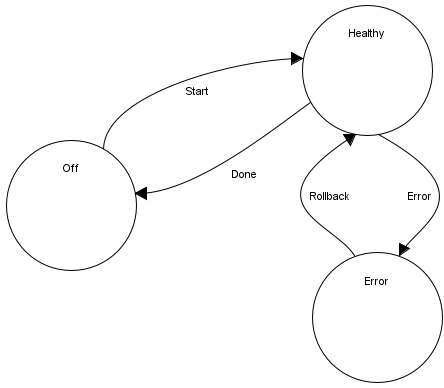
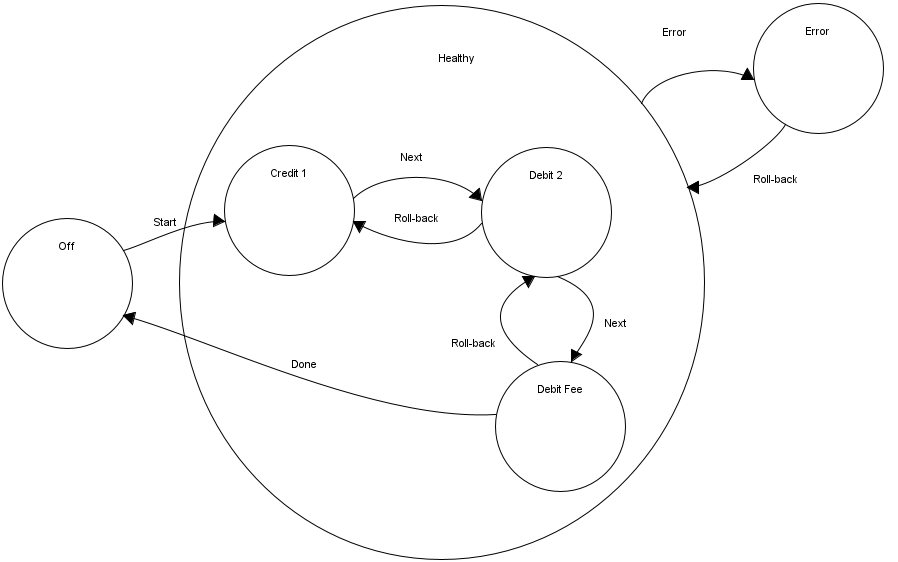

# SagaOrchestrator
Sample Using Finite States Machine to Ensuring Transaction Over Microservices

When using Microservices Architecture, if a task must be done using several micro-services then how to manage this task as a transaction while we can only call API?
For example, if we transfer an amount of money from account A to account B.
Then we must decrease A and increase B
    - What if we decreased A, but we failed increasing B?
    - What if we failed decreasing A?
Howto control the exceptions in this case?

This sample using Accellerate Finite State Machine to implement Orchestrator Saga Pattern.
Let's say we have:
  - Big Orchestrator
  - Micro-service A
  - Micro-service B
We will build a FSM at the Orchestrator to control the whole process.

  
  